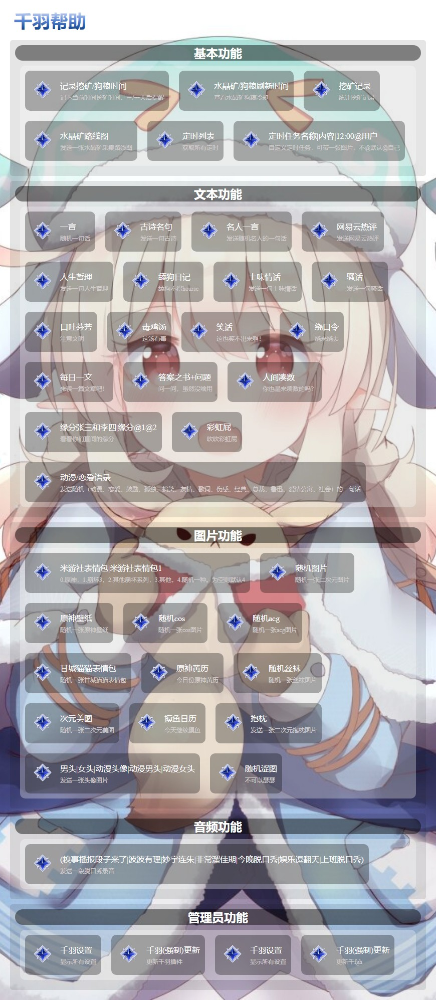

## 千羽插件

### 1.安装

云崽根目录下执行安装命令

```javascript
git clone --depth=1 https://gitee.com/think-first-sxs/qianyu-plugin.git ./plugins/qianyu-plugin/
```

### 2.功能



1. #### v2 云崽插件用于 v3 云崽（仅 js 插件）

   ##### 使用说明

   将 v2 的 js 插件放入 qianyu-plugin/apps/V2/目录下即可

   ##### 注意事项

   - 此功能会自动跳过引入错误的插件
   - 引入插件是使用者个人行为，如有侵权作者不负任何责任
   - 作者不会在此目录下放入任何插件
   - 作者不负责引入插件中的内部错误，如有报错请放弃此插件
   - 请勿删除目录下的 index.js 文件，改文件为引入插件文件，删除会导致引入错误

2. #### 群事件

   - 进退群回复，支持自定义回复
     - #千羽群设置进群回复（支持图片文字）
     - #千羽群设置退群回复（支持图片文字）
     - 私聊设置则为全局群配置，群里为当前群配置，群独立配置
   - 群撤回回复
     - 需要自己手动添加群号，后续增加指令
   - 有趣禁用提醒
     - 口球你喜欢吗？
   - 回复通过群申请
     - 由于和老版插件功能重复，已关闭
   - 群戳一戳
     - #千羽戳一戳开启/关闭
     - 戳一戳配置文件在 qianyu-plugin/config/chuo.yaml,详细配置请看配置文件

3. #### 其他功能

   - 早晚安功能
   
4. #### ai功能

   默认群聊at和前缀机器人会触发ai

   -  #千羽设置ai私聊开启/关闭  私聊机器人的ai开关
   - #千羽设置ai群聊开启/关闭   群里ai触发的总开关，默认开启，关闭后at和前缀机器人ai将不会反应
   - #千羽设置ai概率100（0-100设置的值）私聊机器人触发ai的概率
   - #千羽设置私聊ai小爱同学  设置私聊ai的为哪一个ai,可以选择的值为(青云客、夸克、小爱同学、思知）
   - #千羽设置ai名称云崽    设置ai的名字为云崽，可以随意设置，请勿为空
   - #千羽设置群ai开启/关闭  设置单独群的ai开关，不影响at和前缀，at和前缀同样也不受概率的影响为100%触发
   - #千羽设置ai群概率100  设置单独群ai的触发概率
   - #千羽设置群聊ai小爱同学  设置群聊ai的为哪一个ai,可以选择的值为(青云客、夸克、小爱同学、思知）

5. #### 报时功能（在群里发#千羽设置）

   - #千羽设置群报时开启  设置单独群的报时开关
   - #千羽设置中文报时开启  小时数转换成中文
   - #千羽设置图片报时开启   在报时时发送一张图片
   - #千羽设置语音报时开启   在报时时发送一条原神角色语音和消息
   - #千羽设置报时角色+原神角色   设置报时的原神角色，默认全角色随机

6. #### 解析功能（群里专用功能）

   解析功能依靠api实现，可能不稳定，如果功能寄了，耐心等待即可，或者加群反馈

   - #千羽设置b站解析开启/关闭   识别群里发送的b站视频链接和卡片发送视频
   - #千羽设置短视频解析开启/关闭   识别群里发送的抖音、快手、皮皮虾视频链接发送视频

### 3.设置

#### 禁用功能（仅千羽插件功能）

在 qianyu-plugin/config/目录下的 set.yaml 文件配置

```yaml
blacklist: #黑名单（禁用功能）
  - ai #比如禁用ai
```

功能的具体名称请根据每个功能文件的 id 为准，比如 ai:

```javascript
let apps = {
  id: "ai", //以这个id为准
  name: "人工智障ai",
  desc: "人工智障ai",
  event: "message",
  priority: 100000,
  rule: [],
};
```

#### 全局功能设置（仅千羽插件功能）

在 qianyu-plugin/config/目录下的 set.yaml 文件配置

```yaml
globelist: #全局功能列表（在此添加的功能不会受到群前缀的影响，会正常的响应）
  - greeting #全局响应早晚安，不受群前缀的影响
```

设置全局的功能，将不受云崽设置的群前缀影响，即使开了前缀，配置了全局的功能也能无前缀响应

### 4.交流与反馈

QQ 群：644134535

### 5.支持作者

爱发电：[https://afdian.net/a/qianyu-plugin](https://gitee.com/link?target=https%3A%2F%2Fafdian.net%2Fa%2Fqianyu-plugin)

打赏名单

|  昵称  | 打赏金额 |
| :----: | :------: |
| 黑甘雨 |   180    |
|  倾听  |    10    |
|  久遇  |    10    |
|  黑兔  |    5     |
|  噎羊  |    5     |

#### 参与贡献

1. Fork 本仓库
2. 新建 Feat_xxx 分支
3. 提交代码
4. 新建 Pull Request

#### 免责声明

1. 功能仅限内部交流与小范围使用，请勿将 Yunzai-Bot 及 qianyu-plugin 用于任何以盈利为目的的场景.
2. 图片与其他素材均来自于网络，仅供交流学习使用，如有侵权请联系，会立即删除.

#### 访问数量：

[](https://gitee.com/think-first-sxs/qianyu-plugin/)
