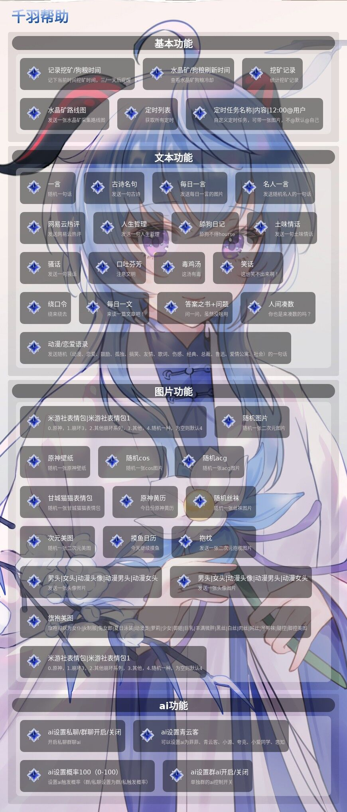

# qianyu-plugin


云崽 3 插件

#### 安装

在云崽根目录下输入命令
//安装
```js
//推荐gitee安装
git clone --depth=1 https://gitee.com/think-first-sxs/qianyu-plugin.git ./plugins/qianyu-plugin/
//github安装
git clone --depth=1 https://github.com/shixiansi/qianyu-plugin.git ./plugins/qianyu-plugin/

```

#功能
报时、记录挖矿/狗粮时间（到点@提醒）



#### ai 帮助

- ai 设置(私聊/群聊)开启（仅支持私聊设置）
- ai 设置概率(0-100)（私聊设置概率仅影响私聊，群聊一样不互相影响）
- ai 设置群聊关闭后所有群的 ai 都不会触发
- ai 设置群 ai 关闭/开启和概率每个群都是独立的
- 后期将进行单个群聊 ai 指定，敬请期待！

####  参与贡献

1. Fork 本仓库
2. 新建 Feat_xxx 分支
3. 提交代码
4. 新建 Pull Request

#### 免责声明

1. 功能仅限内部交流与小范围使用，请勿将Yunzai-Bot及qianyu-plugin用于任何以盈利为目的的场景.
2. 图片与其他素材均来自于网络，仅供交流学习使用，如有侵权请联系，会立即删除.

#### 联系方式

QQ：1765629830
